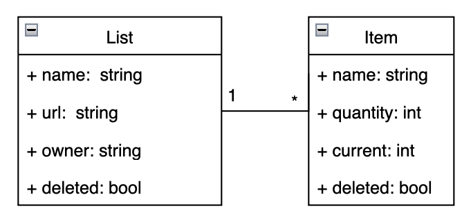
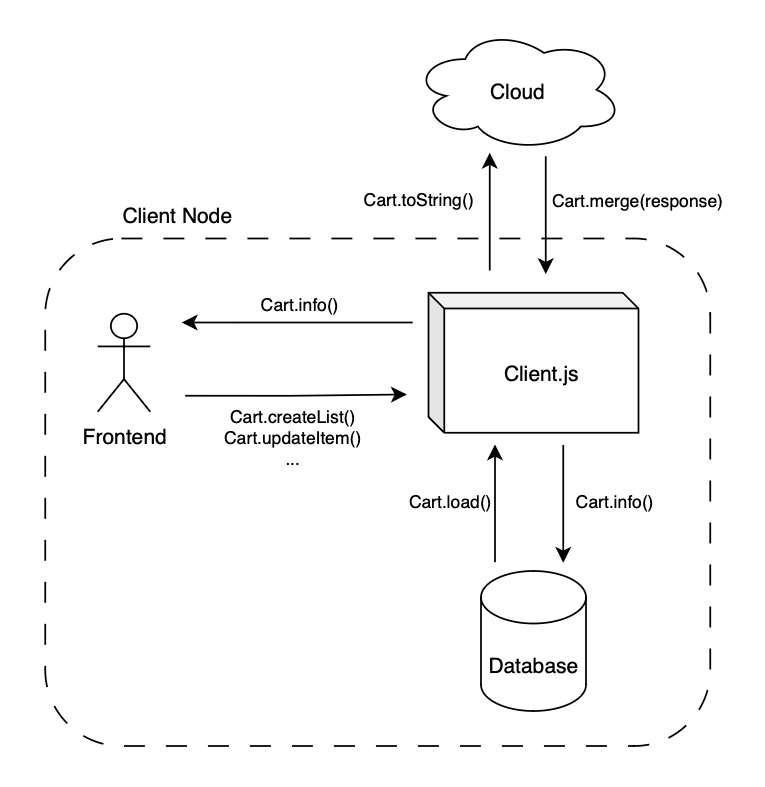
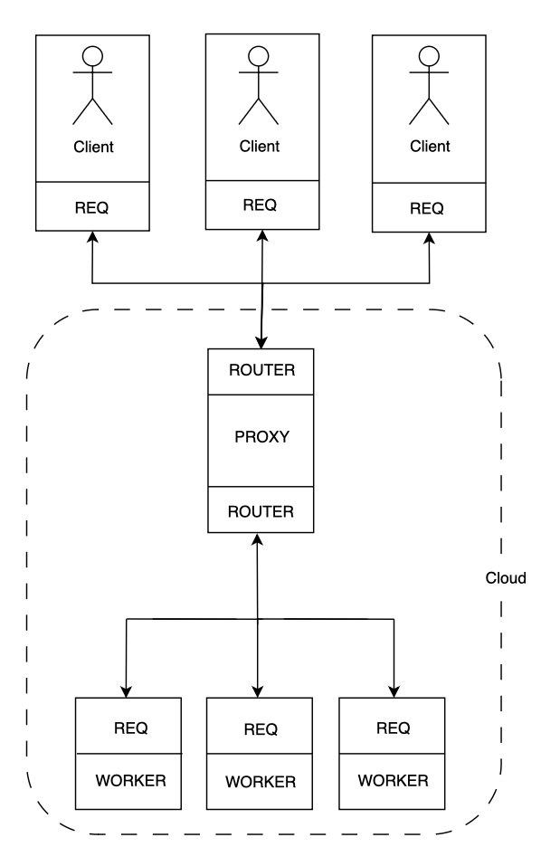
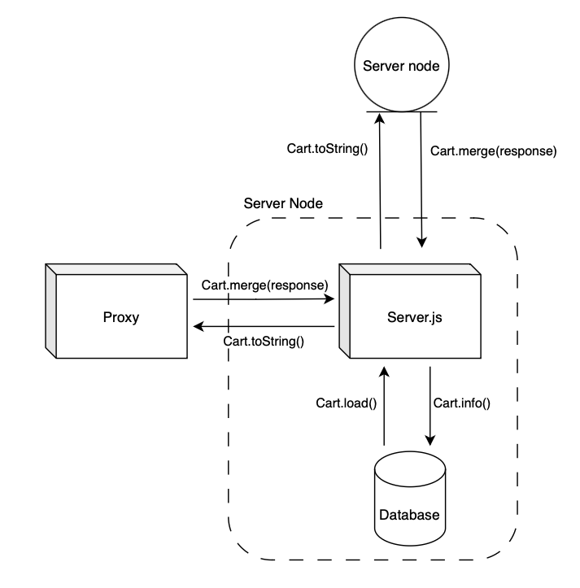
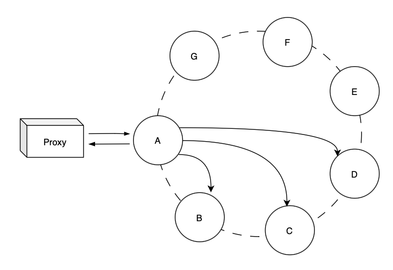

# Report - Presentation

- André Costa, up201905916@up.pt
- Bárbara Carvalho, up202004695@up.pt
- Fábio Sá, up202007658@up.pt
- Luís Cabral, up202006464@up.pt

--- 1

## Index

- [0. Context and Overview](#0-context-and-overview)
- [1. Technology](#1-technology)
- [2. Cart API](#2-cart-api) 
- [3. Local First](#3-local-first)
- [4. Cloud](#4-cloud)
    - [4.1 Replication between nodes](#41-replication-between-nodes)
- [5. User Interface](#)
- [6. References](#5-references)

--- 2

## 0. Context and overview

- `Local-First Design`: prioritizes a local-first approach, running code on user devices for data persistence. This ensures offline functionality, enhancing user experience by allowing them to access and modify their shopping lists without an internet connection.

- `Collaborative Lists`: each shopping list has a unique ID, facilitating collaboration. Users with the list ID can seamlessly collaborate, enabling them to collectively manage and update shopping lists.

--- 3

## 1. Technology

We opted for user-friendly web application, prioritizing simplicity in technology choices for easy installation and use.

- `Node.js`, for client and server side applications;
- `SQLite3`, for local database management system;

Additionally, for distributed system connections, cloud management, and maintaining integrity and consistency:

- `ZeroMQ`, for high-performance asynchronous messaging;
- `UUID`, for the generation of unique identifiers across the entire system;

--- 4

## 2. Cart API

Each node in the distributed system instantiates and manipulates a "Cart" object that gathers CRUD (Create, Read, Update, Delete) functions and data consistency features.

```js
const cart = new Cart(<node-id>);
cart.load(db);

const url = cart.createList('List A');
cart.deleteItem(url, 'Apple');
cart.updateItem(url, 'Soup', 6, 7);

cart.info()     // get information for frontend
cart.toString() // serialize object for messaging and merge

// syncronization
cart1.merge(cart2.toString())
cart2.merge(cart1.toString())
```

### Advantages:

- Functional for any node in the system (client or server);
- Encapsulates complex operations and algorithms for data consistency (CRDTs);
- It is the only variable that nodes have to manipulate, simplifying concurrency control.

--- 5

### Implementation

- Cart contains a Map between the URL of each list and an AWORSet, enabling constant-time data retrieval for a list, O(1);
- AWORSet (*Add Wins Observed Remove Set*), a State-Based CRDT, keeps track of all causal contexts of the list but only retains in memory the items that have not been removed, improving spatial performance;
- GCounter (*Grow-only Counter*) manipulates the total and partial quantities of each item;

```js
class Cart {
  this.lists = new Map();   // Map<url, AWORSet>
}

class AWORSet {
  this.set = []             // [(itemName, GCounter, (nodeID, version))]
  this.causalContext = []   // [(nodeID, version)]
}

class GCounter {
  this.currentValue = 0;
  this.totalValue = 0;
}
```

--- 6

## 3. Local First

- In the initial phase, the client app checks for the presence of a local database following the predefined schema;

<p align="center">
  
  <p align="center">Figure 1: Database Schema</p>
</p><br>

- The URL is instantiated locally using UUID v4:
  - global uniqueness
  - it does not rely on any user input, which may not be unique throughout the system
  - is independent of timestamps, which can be desynchronized between nodes

- Only the owner of the list (the node that instantiated it) can delete it, and this operation is irreversible, propagating throughout the entire system.

--- 7

<p align="center">
  
  <p align="center">Figure 2: Local First approach</p>
</p><br>

- `Frontend request management`;
- `Fault tolerance`: periodically, the current state of the Cart is stored in the local database, allowing data recovery from the node in case of failure;
- `Cloud connection`: periodically, if there is a connection to the cloud, the current state of the cart is sent. The response, which is a sub-state of the server that the client should be aware of for the update, can be merged immediately.

Improved management and isolation of each action by using `Worker Threads`, with `Locks` for concurrency control.

--- 8

## 4. Cloud

Clients exclusively connect to a central proxy server

- An end-to-end system without user awareness of cloud details, including server numbers or addresses;
- Elimination of the need for a fixed connection between the client and server or a fixed number of servers always available;

<TODO: Load Balancer. Este texto pode não estar atualizado>

The implemented proxy server serves a critical additional function: load balancing [4]. Load balancing is essential to prevent performance degradation or bottlenecks when handling extensive requests on a single server, ultimately enhancing the efficiency of the entire system. For load balancing, the ZeroMQ library is employed, utilizing ROUTER-REQ connections in both the frontend (client-proxy connection) and the backend (proxy-server connection).

<p align="center">
  
  <p align="center">Figure 3: Proxy as Load Balancer</p>
</p><br>

--- 9

<p align="center">
  
  <p align="center">Figure 4: Cloud Node</p>
</p><br>

- `Client request management`: Receives the current state from the client, merges it, and returns the relevant sub-state to the client;
- `Fault tolerance`: periodically, the current state of the Cart is stored in the local database, enabling data recovery from the node in case of failure;
- `Ring replication`: each server can periodically send its state to another neighboring server or receive updates from its neighbors;

--- 10

### 4.1 Replication between nodes

- To ensure eventual consistency across the entire system (lists sharding)

- Upon instantiation servers gain access to a list of neighboring servers. 

- The order of each server's list enables the construction of a dependency network in the form of a ring;

<p align="center">
  
  <p align="center">Figure 5: Replication ring</p>
</p><br>

- Periodicamente it proceeds to communicate and propagate this alteration to the N neighboring nodes, following the specified order.

- If a server among the chosen N servers does not respond, it is skipped, and communication is redirected to another remaining server.

- An interruption or failure of a node does not signify a permanent exit from the ring; therefore, it should not result in the rebalancing of the assignment of these partitions.

--- 11

## 5. User Interface

### TODO

--- 12

## 6. Improvements

### Why isn't the causal context of a list also stored in the local database?

We don't need. Merging causal contexts is simply a union of two sets, so if the node loses the causal context, it can easily recover it in the first interaction with the cloud.

### How is the import of a list from the cloud implemented?

The client simply needs to instantiate a list on their side with the imported URL. The merge between two lists is designed to not only merge the items in the list but also update their attributes (owner name, list name, deleted flag, loaded flag) that were previously unknown. In the first interaction with the cloud, all the content of the imported list becomes known.

### Is the output of a server's merge always its entire state?

No. For efficiency reasons, the output of the server after its internal merge is never its entire content and depends on the requesting node:

### In any node (client, server), is the storage to the Cart state database always performed?

No. For performance reasons, storing information in the local database is only done when the Cart detects an internal change.

- `Client-server interaction`: the client only receives the subset of the cart state that matters to it, i.e., the latest version of the lists it knows.
- `Server-server interaction`: the other server only receives an 'ACK' to confirm receipt. At this stage, there is no need to exchange the total content of the two servers since, being arranged in a ring, they will soon receive the content from their neighbors.

--- 13

## 7. References

- [1] - [Amazon Dynamo](https://www.allthingsdistributed.com/files/amazon-dynamo-sosp2007.pdf)
- [2] - [CRDT](https://crdt.tech/papers.html)
- [3] - [Delta enabled CRDTs](https://github.com/CBaquero/delta-enabled-crdts)
- [4] - [Load Balancer](https://zguide.zeromq.org/docs/chapter3/#The-Load-Balancing-Pattern)
- [5] - [Local First](https://www.inkandswitch.com/local-first/)
- [6] - [UUID in JS](https://www.npmjs.com/package/uuid)
- [7] - [Worker Threads](https://nodejs.org/api/worker_threads.html)
- [8] - [ZeroMQ.js](https://github.com/zeromq/zeromq.js#examples)

#### T05, SDLE 2023/24

--- 14